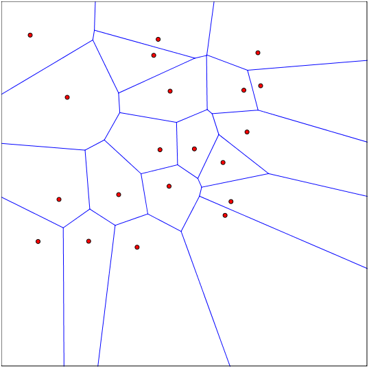

## 5.4
1. What, if any, is the difference between a point estimator and a function estimator?
2. What is the bias of a point estimator?
3. When is an estimator unbiased?
4. What is the intuition behind the variance of an estimator?
5. What is the Standard Error (SE) of an estimator?
6. How does the variance of an estimator influence the conclusions we can draw from it with different sample sizes?
7. How is the standard error of the mean useful for machine learning experiments?
8. Which of the following statements are false?
  a. We can say that and algorithm A is better than algorithm B if the upper bound of the 95 percent confidence interval for the error of algorithm A is less than the lower bound of the 95 percent confidence interval for the error of algorithm B,
  b. We can say that algorithm A is better than  algorithm B if the upper bound of the 95 percent confidence interval for the error of algorithm A is less than the upper bound of the 95 percent confidence interval for the error of algorithm B,
  c. We can say that algorithm A is better than  algorithm B if the 95 percent confidence interval for the error of algorithm A is contained in the 95 percent confidence interval for the error of algorithm B,
  d. If the 95 confidence interval for the error of algorithm A and algorithm B are computed using different samples, we can still say that and algorithm A is better than algorithm B if the upper bound of the 95 percent confidence interval for the error of algorithm A is less than the lower bound of the 95 percent confidence interval for the error of algorithm B
9. You are given two choices to reduce either the bias and variance of your estimator, which would you choose if h=0.5? Which would you choose if h=2?
  a. Increase the bias of your estimator by h, but decrease the variance of your estimator by h, or
  b. decrease the bias of your estimator by h, but increase the variance of your estimator by h.
10. What is the difference between weak consistency and strong consistency?
11. In the example of estimating the mean of a Gaussian distribution at the end of chapter 5.4.5, why is the estimator asymptotically unbiased but not consistent?

## Chapter 5.5
1. Why can we express the maximum likelihood estimator in equation 5.57 as a product of probabilities?
2. Why doesn’t the optimum of the maximum likelihood estimator (equation 5.57) change when we take the logarithm (equation 5.58)?
3. What is the motivation for taking the logarithm of the ML estimator?
4. In the context of fitting an estimator, why is minimizing the KL divergence the same as minimizing the cross entropy between the empirical data distribution and the model distribution?
5. For which model distribution is minimizing Mean Squared Error equivalent to minimizing the cross entropy?
6. Why can the negative log likelihood become negative when x is real valued?
7. When considering linear regression as a maximum likelihood procedure, why does the log-likelihood (equation 5.65) have a sum of squared errors term?
8. Under what conditions is the maximum likelihood estimator consistent?
9. What is meant by statistical efficiency?

## Chapter 5.6
1. What are the different views in frequentist and Bayesian statistics on the parameter value 𝜃 we try to estimate?
2. What are the different views in frequentist and Bayesian statistics on the data we use for estimating a parameter?
3. In Bayesian statistics, what is meant by:
  a. a prior distribution,
  b. a likelihood and
  c. a posterior distribution?
4. What is the drawback of a single point estimate? Are there some benefits?
5. As a user of a prediction, why would the prediction distribution (like in equation 5.68) be useful? 
6. What is the Bayesian view of overfitting?
7. If someone criticizes a Bayesian model of being too subjective, what might they be referring to?
8. What is a reason for the high computational cost of Bayesian methods?
9. What is a maximum a posteriori point estimate?
10. What is the connection between weight decay and maximum a posteriori estimation for linear regression?
11. For linear regression with weight decay, if we let the regularization coefficient lambda go to zero, how should that be interpreted in terms of the prior on the weights for Bayesian inference with a Gaussian prior?
12. What are some examples of regularization penalties which do not correspond to MAP Bayesian inference?

## Chapter 5.7
1. Which conditional distribution on y does logistic regression parameterize?
2. How are feature functions and kernel functions related?
3. In the kernel trick of SVMs, what is a property of the feature function 𝜙(x) which makes the optimization convex?
4. What are some drawbacks of kernel machines?
5. What are the support vectors of support vector machines?
6. What makes k-nearest neighbour a good learning algorithm?  What are its drawbacks?
7. What kind of decision boundaries makes decision trees suffer? Why?

## Chapter 5.8
1. What is an informal definition of unsupervised learning?
2. What are some examples of simpler representations (simpler compared to the original representation of a datum x)?
3. What is meant by independent representations?
4. Which two criteria of simple representations does PCA learn?
5. What is the key feature of the covariance matrix of the PCA-transformed data?
6. What is the difference between a one-hot and a distributed representation?

## Chapter 5.9
1. What is the difference between batch gradient descent, minibatch gradient descent and stochastic gradient descent?
2. Why could it be considered foolhardy and unprincipled to apply gradient descent to nonconvex optimization problems?
3. From a certain point of view, the asymptotic cost of training a model with SGD is O(1) as a function of m (number of datapoints), what point of view makes it so, and is it  reasonable?

## Chapter 5.10
1. What simple ingredients can describe almost all machine learning algorithms?
2. What simple changes can turn supervised linear regression into an unsupervised problem?
3. When does a machine learning algorithm need a special-case optimizer and can you give an example of such? 

## Chapter 5.11
1. What is meant by the statistical challenge of the curse of dimensionality?
2. What is the smoothness prior?
3. What is a prime example of a learning algorithm which relies only on the smoothness prior?
4. What is the below figure supposed to illustrate?

5. What is a local kernel?
6. What is meant by the assumption of hierarchical composition of factors?
7. What is meant by a manifold in the field of machine learning?
8. What is the manifold hypothesis in machine learning?
9. What is the idea of manifold learning?

